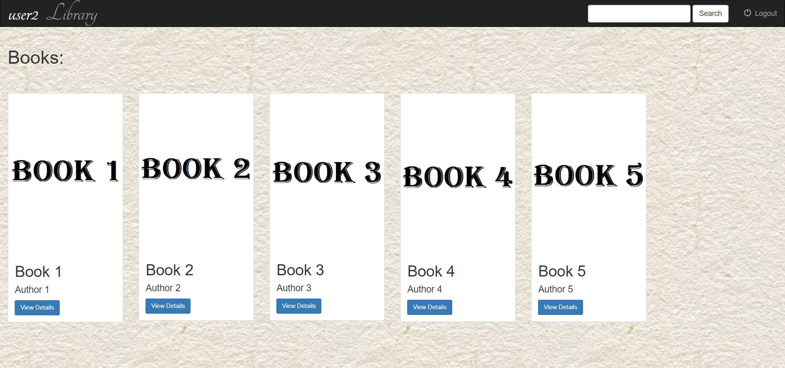
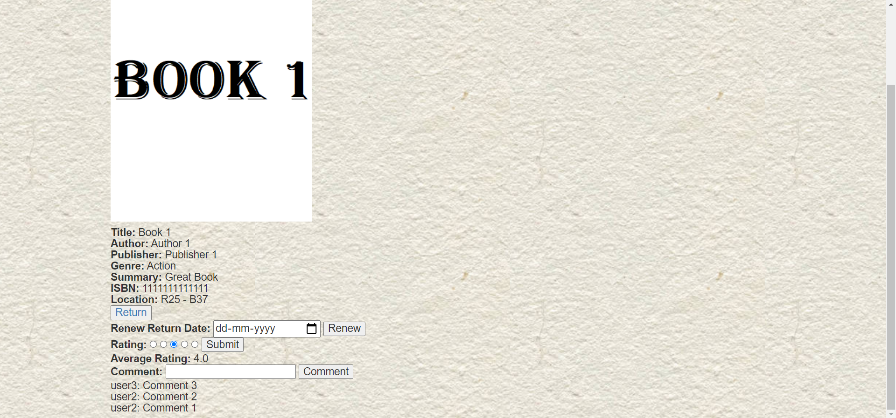
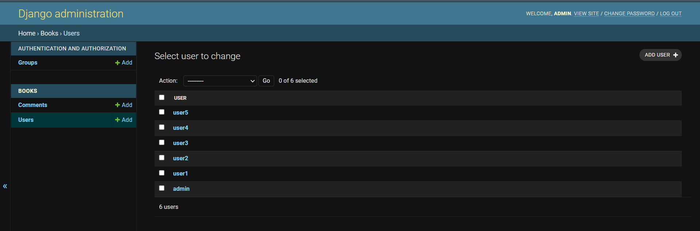

# Library Web App

This web app is a library management system that allows the fast and simple transferring, returning and management of books.
 
# Note
If you are running it locally, you must have django 3.2 installed. Go to the library folder with manage.py and run the command "python manage.py runserver" in the terminal. Then, go to the link given in the terminal or go to localhost:8000.
 

## Table of Contents  
 - [User Login/Register](#user-login)  
 - [Member](#member)
 - [Librarian](#librarian)
 - [Search](#search)  
 - [Admin](#admin)

 
<a name="user-login"/>

## User Login
On going to the link, it redirects you to a login page, where you can enter your username and password. If you don't have an account, there is a link where you can register.

 

 
 
<a name="member"/>

## Member

The user can see the list of all the books available and can see the details of each book.
 

 
If the user is not a librarian, the can comment on the book, give it a rating or borrow it by specifying the return date. 
 

 
If their request is accepted, they can choose to either return the book or renew their return date.
 

 
Users can also see their details in their homepage along with their accepted, pending and rejected requests.
 

 
<a name="librarian"/>

## Librarian
If the user is a librarian, they can edit or delete any book. 
 

 
They can also see all the pending requests and renew requests and can choose to accept or reject them.
 

 
<a name="search"/>

## Search

Members and librarians can also use the search bar to help them find books based on the books' title, author, location etc.
 

 
<a name="admin"/>

## Admin

 
If the user is an admin, they can see all the users and comments. 
 

 
The admin can make a member a librarian and vise-versa along with editing and deleting any user or comment.
 

 

Admins also have their own ligin page, in which only admins can login.
 

